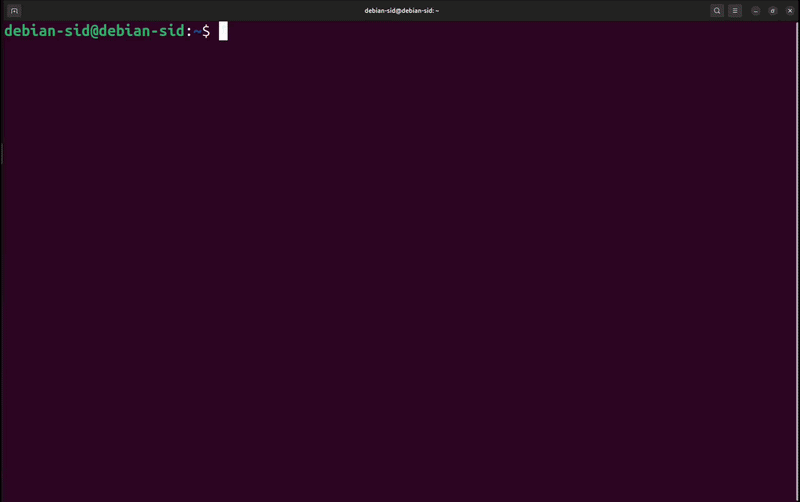

# debsb

Debian Sid sandbox in one command. Downloads a Debian cloud image, boots it in QEMU/KVM, and gives you an isolated VM with auto-login, SSH, and shared filesystem. No kernel building, no complex setup.



## Motivation

I just want a fully hackable Debian setup—both user space and kernel—within a restricted sandbox.

I want to avoid rebuilding an OpenSSH-enabled rootfs for each fuzzing test and repeatedly using the `-kernel` and `-initrd` flags in QEMU.

## Install

```bash
pip install debsb
```

### Architectures

`amd64` (x86_64) and `arm64` (aarch64) hosts are supported. debsb always builds
a sandbox for the host architecture — it picks the matching Debian cloud image,
QEMU binary and machine type automatically, and there is no cross-build mode.
KVM is used when `/dev/kvm` is available and TCG emulation otherwise. A TCG
guest boots several times slower, so debsb scales how long it waits for SSH;
`DEBSB_SSH_TIMEOUT=<seconds>` overrides that budget. The guest console is
recorded to `~/.debsb/serial.log`, and its tail is printed if a guest never
comes up.

### Dependencies

- `qemu-system-x86_64` or `qemu-system-aarch64` (KVM support recommended)
- `qemu-efi-aarch64` — arm64 only, the guest boots via UEFI
- `cloud-image-utils` (`cloud-localds`)
- `whois` (`mkpasswd`)
- `wget`
- `ssh`

On Debian/Ubuntu, amd64:
```bash
sudo apt install qemu-system-x86 cloud-image-utils whois wget openssh-client
```

On Debian/Ubuntu, arm64:
```bash
sudo apt install qemu-system-arm qemu-efi-aarch64 cloud-image-utils whois wget openssh-client
```

For upstream kernel builds (`debsb build <path>`), additionally:
```bash
sudo apt install build-essential flex bison bc libelf-dev libssl-dev libncurses-dev dwarves pahole libdw-dev libdwarf-dev kmod debhelper
```

For `--debian` kernel builds, additionally:
```bash
sudo apt install python3-dacite python3-debian python3-jinja2 debhelper quilt rsync devscripts dh-python
```

On arm64, `--debian` also needs the armhf cross compiler. The Debian arm64 kernel
builds a 32-bit compat vDSO (`CROSS_COMPILE_COMPAT=arm-linux-gnueabihf-`), which
its `debian/control` declares as an arm64-only build dependency:
```bash
sudo apt install gcc-arm-linux-gnueabihf
```

## Usage

### Build the sandbox (one-time)

```bash
debsb build --size 20G
```

This downloads the Debian Sid cloud image, configures SSH keys and auto-login, and runs first boot. All artifacts are stored in `~/.debsb/`.

Use `--reset` to skip the prompt and rebuild from scratch:
```bash
debsb build --size 20G --reset
```

### Build with a custom kernel (upstream)

```bash
debsb build ~/linux --configitem CONFIG_KASAN=y --configitem CONFIG_KCOV=y
```

This:
1. Sets up the cloud image (if not already done)
2. Generates a default kernel config (`make defconfig`) with VM-essential options
3. Applies `--configitem` entries
4. Runs `make olddefconfig` and `make bindeb-pkg`
5. Installs the resulting `.deb` into the VM via GRUB

To build with clang, set `LLVM=1` (or `CC`/`HOSTCC`) in the environment — debsb
forwards these to `make` as command-line assignments, which is the only form
Kbuild honours:
```bash
LLVM=1 debsb build ~/linux --configitem CONFIG_KASAN=y
```
`LLVM=1` also selects `ld.lld`/`llvm-ar`/`llvm-nm`, so install `clang llvm lld`.
Confirm it took effect with `CONFIG_CC_IS_CLANG=y` in the built kernel's config.

### Build with [Debian kernel](https://salsa.debian.org/kernel-team/linux)

This kernel image is built based on the official Debian repository.
- https://salsa.debian.org/kernel-team/linux

```bash
# Default branch (debian/latest)
debsb build --debian --configitem CONFIG_KASAN=y --configitem CONFIG_KCOV=y

# Specific branch
debsb build --debian --branch debian/latest
```

This clones the Debian kernel from `salsa.debian.org/kernel-team/linux.git` and builds the host-architecture kernel package (`binary-arch_<arch>_none_<arch>`) using the Debian packaging rules. `--configitem` entries are written to `debian/config.local/<arch>/config.<arch>` — the official local-override mechanism of the Debian kernel packaging (see its `debian/README.source`, "Kernel config files") — which merges after all stock config files and therefore wins, without modifying any git-tracked file. The resulting kernel is installed into the VM via GRUB.

### Run the sandbox

```bash
# Serial console (auto-login as debian, Ctrl-A X to quit)
debsb run

# SSH session (as debian)
debsb run --ssh

# SSH as root
debsb run --ssh --root

# Run a command and auto-shutdown (requires --ssh)
debsb run --ssh --root --exec "apt update && apt upgrade -y"

# Graphical QEMU window
debsb run --graphics

# With sound
debsb run --sound

# Extra QEMU options
debsb run --qemu-opts='-m 8192'
```

### Execute a command

`--exec` runs a command via SSH and shuts down automatically. Requires `--ssh`:

```bash
debsb run --ssh --exec "uname -a"
debsb run --ssh --root --exec "ls -ahl .debsb"
debsb run --ssh --exec "./my-script.sh"
```

This is useful for CI/automation. The exit code of the command is propagated.

### Verbose mode

Show kernel boot messages:
```bash
debsb run --verbose
```

## Shared filesystem

Your host `~/.debsb/` directory is mounted inside the VM at:
- `/root/.debsb` (symlink to `/mnt/debsb`)
- `/home/debian/.debsb` (symlink to `/mnt/debsb`)

This is automatic — no manual mounting needed.

## How it works

1. Downloads `debian-sid-generic-<arch>-daily.qcow2` from cloud.debian.org
2. Creates a cloud-init ISO with SSH keys, user config, and auto-login
3. Boots the VM with QEMU/KVM and waits for cloud-init to finish
4. On subsequent `debsb run`, boots the prepared image directly

Per-architecture differences are handled internally:

| | amd64 | arm64 |
|---|---|---|
| QEMU | `qemu-system-x86_64` | `qemu-system-aarch64 -machine virt` |
| Firmware | SeaBIOS (built in) | AAVMF/edk2 via pflash, with a writable var store in `~/.debsb/AAVMF_VARS.fd` |
| Disks | IDE (`/dev/sda`), cloud-init seed as CD-ROM | virtio (`/dev/vda`), cloud-init seed as a virtio disk |
| Serial console | `ttyS0` | `ttyAMA0` |
| Graphics (`--graphics`) | `-vga virtio` | `virtio-gpu-pci` |

When building with a kernel (`debsb build <path>` or `debsb build --debian`):
- The kernel `.deb` is installed into the VM
- GRUB is updated to boot the new kernel by default
- No `-kernel` or `-initrd` flags needed — GRUB handles boot

## Accounts

| User | Access |
|------|--------|
| `debian` | Serial auto-login, SSH with key, sudo NOPASSWD |
| `root` | SSH with key (`--root` flag) |

SSH key: `~/.debsb/id_ed25519` (auto-generated on first build)

## License

GPL-2.0-only
